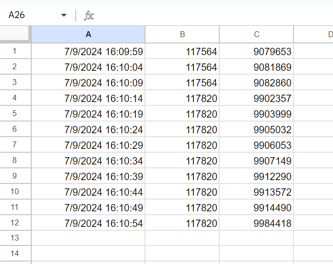

# Google Sheets Data Logger: Log Data Directly to Google Sheets
## Backstory
There are many ways to log data, but few are as easy, powerful, and free like Google Sheets.  Originally, I was developing an app to log data from a sump pump system in a basement using *.csv files.  I thought it would be neat to have the data directly sent to a Google sheet, and have the graphs automatically update, and it was easier than I expected, but I thought a few steps were poorly documented.

So here it is, a step-by-step easy example of logging data from a Raspberry Pi running node.js directly to a Google Sheet.

## How to Use

It’s really easy to use, install Node.js and npm on your distro, then Google API Client and dotenv:
```sh
$ npm install
```

Go to your Google Cloud Console and create a project.  Go to IAM & Admin and [create a service account.](https://cloud.google.com/iam/docs/service-accounts-create)

Create a Google Sheet, and [share the sheet with edit permissions with the service account.](https://support.google.com/a/users/answer/13309904?hl=en#sheets_share_specific)

Note the sheet ID, and put into a line in the .env file in the GoogleSheetsDataLogger:
```Dotenv
SPREADSHEET_ID="PUT_YOUR_SPREADSHEET_ID_HERE"
```

Create and Download a key for the service account and save the .json file ***OUTSIDE*** of your git directory to ensure you do NOT leak they key.

Add two lines to the .env file:
```Dotenv
GCLOUD_PROJECT={YOUR_GOOGLE_CLOUD_PROJECT_ID}
GOOGLE_APPLICATION_CREDENTIALS=/home/PATH_TO_SERVICE_ACCOUNT_KEY_JSON.json
```

That's it! Then run the program:

```sh
$ node GoogleSheetsDataLogger.js
```
Now comes the fun part, add some actual data to replace the example data to actually do something useful:
Change the process.resourceUsage().maxRSS and process.cpuUsage().user on Line #56 to something useful:
```js
measurmentArray.push([(curDate - dateOffset) / dayFraction, process.resourceUsage().maxRSS, process.cpuUsage().user ]); //Variables to save
```

Don't forget to update the Sheet Range on Line #31 if the number of variables is changed:
```js
range: 'Sheet1!A:C',  // Make Sure to change this to match # of Rows in data measurements
```

To see the actual dates, click on column A and set the Format to Number -> Date Time.



This code is extracted from a [sump monitoring system that also captures data from an ADS1115 ADC, uses some IIR filtering and min/max processing.](https://github.com/jeremyrode/sumpmonitor)
